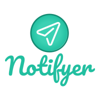
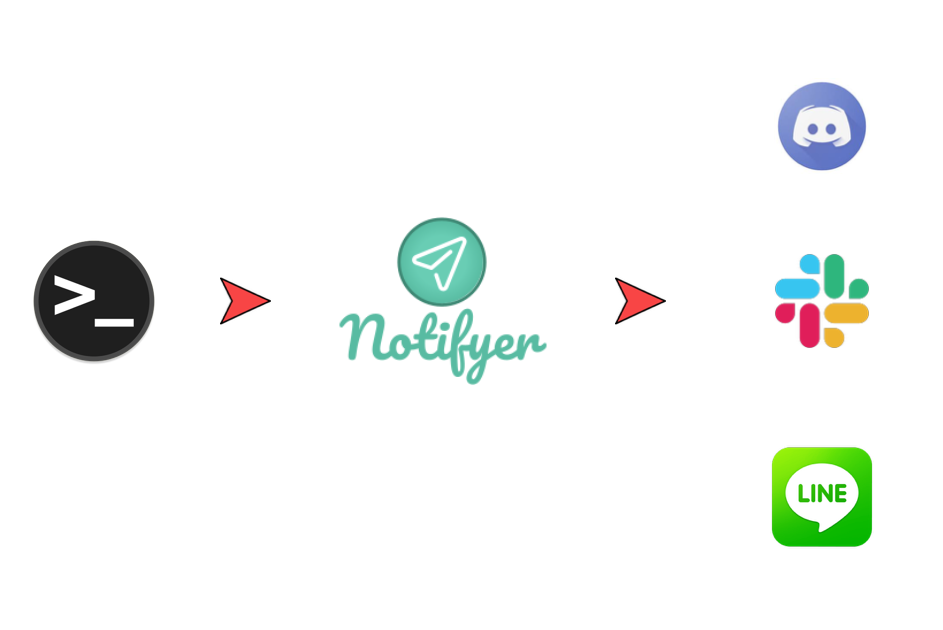

# Notifyer

[![License][license-badge]][license]
[![GoDoc][godoc-badge]][godoc]
[![GolangCI][golangci-badge]][golangci]
[![Go Report Card][go-report-card-badge]][go-report-card]


<br />
<p align="center"><a href="#" target="_blank" rel="noopener noreferrer"></a></p>
<br />

> Extendable notification tool for various services

`notifyer` is a notification tool written in golang. It will read stdin and sends notification to services such as Slack, Discord and so on. You will have to configure by writting TOML file. Don't worry, it is very very simple to configure and to use.

## Support

<br />
<p align="center"><a href="#" target="_blank" rel="noopener noreferrer"></a></p>
<br />

### Input

Currently supports sdtin only.

### Output

<table style="width:100%;text-align:left">
  <tr>
    <th>Service name</th>
    <th>Status</th>
  </tr>
  <tr>
    <td>Slack Incoming Webhook</td>
    <td>○</td>
  </tr>
  <tr>
    <td>Slack API</td>
    <td>○</td>
  </tr>
  <tr>
    <td>Discord Webhook</td>
    <td>○</td>
  </tr>
</table>

## Install

```
$ GO111MODULE=on go get github.com/KeisukeYamashita/notify_discord
```

## Usage

## Config file

The script will check the following files for configuration.

1. `$HOME/.notify_discord`

The config toml file should be in this format.

```toml
[slack]
url         = "hogehoge"
channel     = "poip"

[linebot]
accessToken = ""
to          = ""

[discord]
url         = "https://"
```

## Contribution

* I welcome your contributions.
    * Please send issues and pull requests.

## License

Notifyer is released under the MIT license.

© 2019 GitHub, Inc.

## Author

* [KeisukeYamashita](https://github.com/KeisukeYamashita)

<!-- badge links -->

[license]: LICENSE
[godoc]: https://godoc.org/github.com/KeisukeYamashita/notifyer
[go-report-card]: https://goreportcard.com/report/github.com/KeisukeYamashita/notifyer
[golangci]: https://golangci.com/r/github.com/KeisukeYamashita/notifyer

[license-badge]: https://img.shields.io/badge/license-Apache%202.0-%23E93424
[circleci-badge]: https://img.shields.io/circleci/project/github/micnncim/protocol-buffers-language-server.svg?label=circleci&logo=circleci
[godoc-badge]: https://img.shields.io/badge/godoc.org-reference-blue.svg
[go-report-card-badge]: https://goreportcard.com/badge/github.com/KeisukeYamashita/notifyer
[golangci-badge]: https://golangci.com/badges/github.com/KeisukeYamashita/notifyer